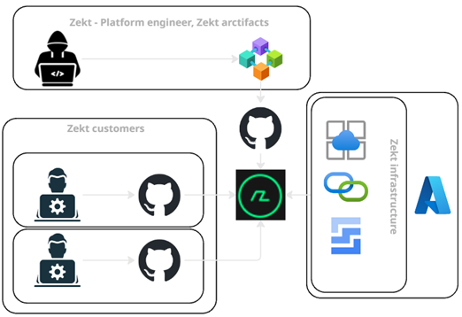

This article serves as a high level descriptive documentation of the of the Zekt system architecture. The documentation is open to the public, will not contain detailed specifications of the system landscape - other then to serve the purpose of the interested, and the internal Zekt architects / engineers.

## - System design principals (infrastructure)

Zekt.dev is built on PaaS services offered within MSFT Azure. The principals are around typical benefits with operating on cloud native offerings from a hyper-scaler, such as:

- Elasticity. As a small startup company, it is vital to keep cost down during development, but then to be able to scale-up (SKU wise) & scale-down (resource wise) with low effort from the zekt engineering community. The approach also provides benefits from a cost perspective, as capex cost of procuring infrastructure at start.

- Focus on outcome / business value. Infrastructure is not business idea. It is something needed, in order to hand out & produce business intent. As such, we want to spend as little focus on infrastructure as possible, without sacrificing security / resilience or other aspects. However, operating on a PaaS level, provides benefits to us, as many aspects of traditional infrastructure is handled by provider of PaaS services.

- As few system components as possible - without sacrificing functionality or business need. Choose wisely. Choose easy to manage / elastic / and broadly adopted PaaS offerings, matching the need of the overall solution design & intent. This concern goes down frameworks / languages used as well. The code base of a SaaS offering will become rather huge rather fast - dont use excessive amounts of different languages and frameworks if there is no obvious rational for it.

- Simplicity. Design for simplicity - it's going to become complex anyway. Expose main components over internet facing technologies & ensure that authorization and authentication happens on all layers (security baseline and hygien factor) - for connectivity simplication - terminate sessions prior to reaching http endpoints to enhance security posture (security simplification).

- Scalability & resilience. This point, very much is connected to the "elastic design principle". However - scalability also take distribution of services into account. System components chosen - should be able to be provided in multi-region setups to provide redundancy & routing capabilities if needed. For now, zekt.dev is hosted in single region setup - but should be extendable to where business need arise.

## - System architecture - high level description

- [www.zekt.dev](https://www.zekt.dev) is the public facing entry point for servicing customers. The website - allow users to perform self-service onboarding using their "existing" github identities which the website makes use of for deep integration to github. Except the usual - welcoming a customer to the website & information package that is expected - the main purpose, is to funnel customers to the orchestration product - which can be accessed once onboarding has been done. 

Website is hosted on managed webapp in Azure - acting as the frontend layer. User tokens are never intended to become accesible within the frontend components, as it should be proxied directly to the backend API's of Zekt. Terminating layers are in place to ensure boarder protection, endpoint are encrypted (using valid certificates).

Frontend layer act as primary content serving layer (tier #1) to end customers.

- All frontend fuctionality that requires deeper integration / logical processing - are de-coupled logically and physically - to the backend API's layer. Zekt backend API's are hosted on Azure PaaS services, featuring endpoint encryption (in transit) and access blockers. Most endpoints are requiring authorization & authentication to be used (not all since there are edge cases which require public access). The backend API layer act as second tier (tier #2) in the overall solution design.

- Persitency layer. Zekt needs to persist information of its services (ranging from customer information - to business & functionality requirements). Zekt uses a persistency layer, that is only reachable through API's fronting the layer. Public / un-authenticated API's can never reach the persistency layer of Zekt (one should never say never - but that is the intention...). The persistency layer act as tier #3.

- Configuration updates & new functionality - are all pushed through pipelines (CI/CD), version handled and deployed to endpoints in a consistent manor. We are going to introduce AB testing slots shortly, to ensure backtracking & easy roll-out of new functionality as we progress.

Below is a referencing (high level) system landscape picture:

