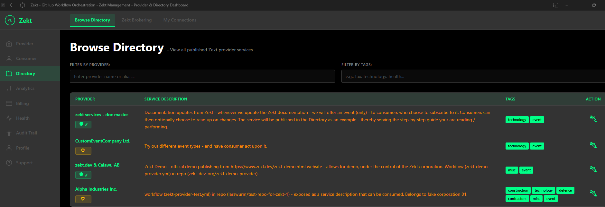
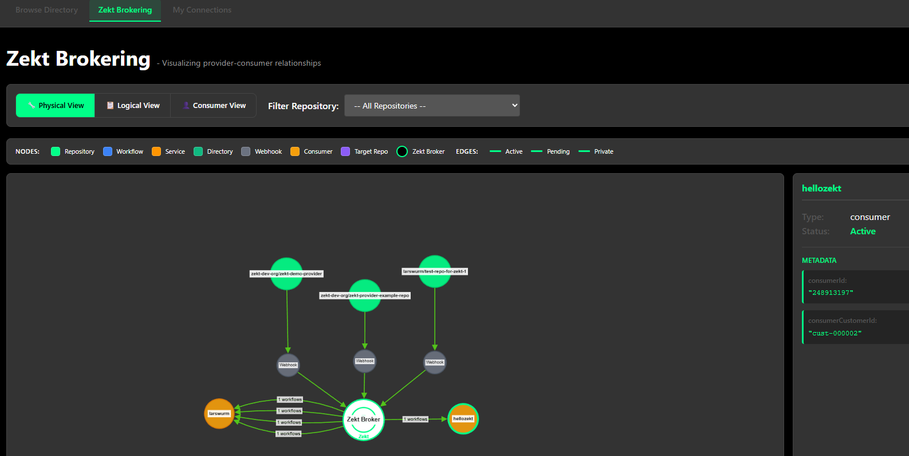

## - Zekt Directory - one stop shop for published services

Once a provider persona has enabled a repository in Zekt, whitelisted a workflow - associated it with service description and choosen to publish it to the Zekt directory - it is instantly discoverable to the broader consumers of Zekt. The directory is where you / your customers go to find your service (if you are a provider) and then easily have zekt connect you by brokering the events & messages. For a high level description of the Zekt Directory - [click here](/zekt-docs/overview/zekt-directory/) 

This documentation section - will outline the Directory - and how a newly created service is looking once it is published. Open the Zekt management console - find the navigation item named "Directory", then select "Browse Directory". A picture is shown below how it looks in our environment:

1. The "Provider" column, shows you "who" is providing the service listed in the directory. There is also a "trust badge" shown - to be able to have some confidence in provider.
2. The "Service Description" column, shows you "what" the service provides in terms of value.
3. Associated service tags - which can be used in the filtering option above by the consumers.
4. The "Action" column icon - can be used, if you as a consumer decides that you want to consume the published service - from the directory view! Once you click on the "action icon" - you will have to submit a request (from consumer) to provider (to approve request) in order for Zekt to broker the connection. This "approval flow" is outlined in greater detail - by clicking here!

## - Zekt brokering visualization

If you are a provider using Zekt - to broker events and messages to designated consumers - you need a way of visualizing "who is consuming from me, how are they connected" and so forth - especially at scale - with loads of consumers connected to a single "service" (1-to-many brokering scenario). Zekt uses the management console tabs:

Zekt Brokering & My Connections - to accomedate the visualization of how service to consumers mappings are done from different perspectives. We will start with the tab "Zekt Brokering" tab which supports 3 different views: Physical / Logical / Consumer

We will start to outline the physical view first, as shown below (example):

This view tries to illustrate - how the "physical" connectivity is looking creating the brokering mesh of Zekt and your services. In the above example:

- We can see 3 (green bubbles) provider repositories under the zekt accounts control. Select the individual repo - and get details on the right hand side
- Each provider repo is having its own webhook. Select the webhook - and get details on the right hand side
- Servicing 2 consumers (not consumer repos, but recievers / consumers) illustrated by orange bubbles. Click on them individually - and get details on the right hand side
- Workflow(s) - are indicated between as the Zekt router and the consumer - which is not entirely true - but serves as a good example of understand how the workflows are logically conntected to individual consumer accounts.

The logical view - is very much geared towards the provider persona. It tries to illustrate how the provider components are all connected from their perspective to the Zekt router capability. An example is shown below (same example as within the physical view):

From this picture we can determine the following:

- Individual providing repos, under the control of the zekt account logged in. In this view represented by "green bubbles". Select each, to get details displayed on the right hand side of the management console - relating to the repository.
- Individual whitelisted workflows within each providing repository. The whitelisted workflows are the "blue bubbles". Select each, to get details displayed on the right hand side of the management console - relating to the workflows.
- The "orange bubbles" are the "service publisher alias name" - under which the provider published their service (towards consumers). 
- The zekt directory (singular) is listed as the provider directory - and acts as the center for the published services. Finally - the directory is always connected to the Zekt routing capability.

