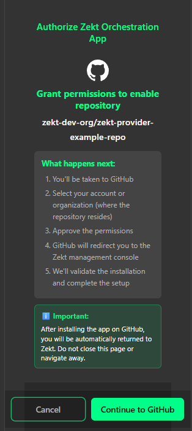
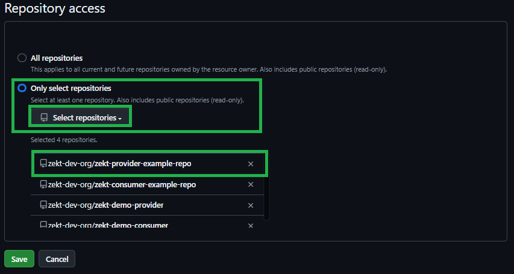
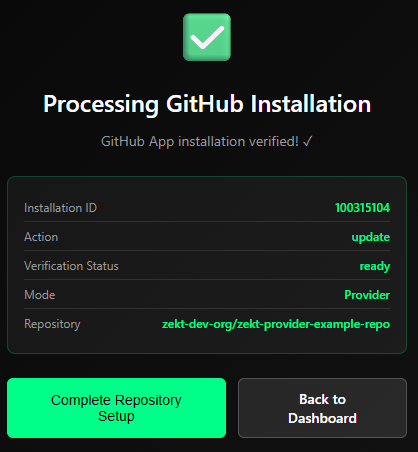
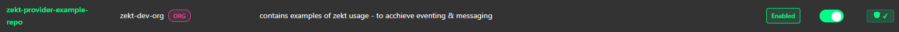

## - Zekt Repos (Provider)

The management console (UI) - is having persona based navigation items. Top one, being the "Provider" item. As soon as you click on it, you will be taken to the "Zekt Repos" tab (for the provider persona). In this view - you will be able to enable / disable repositories for which you are in control of. The enablement is about instrumenting the repositories with the required Zekt Orchestration App (approving it) and placing the required Zekt webhook in the target repository. Likewise, you can disable a Zekt repository from this UI - when the repository is no longer needed.

### - Enable Zekt repository (first time enablement scenario)

This section shows the basic steps (and verification steps) to perform as a customer, when enabling a zekt provider repository. Follow sequence below:

1. Select the repository - which you want to enable for Zekt services from the list of a available repositories. Toggle the switch button in the "Actions" column. Please note that repositories that are not enabled are having the status badge of "Disabled" prior to becoming "Enabled" once you are done with activating the repository. See supportive picture below:

2. Once you toggle the switch to enable repository - a pop-up will appear, which informs you that you will need to approve and install the ["Zekt Orchestrator App"](/zekt-docs/overview/zekt-apps/) on the target provider repository in order to have it enabled. Press "Continue to Github" button - to proceed. Pop-up modal shown below:

Once you press the "Continue to Github" button - you will be redirected to Github to proceed with installing the "Zekt Orchestration App" for the target repository.

3. You have now been re-directed to Github - where you will need to select the "owning entity" of the repository. A Github repository can either be owned by a personal account or by a Github organization. Zekt supports both combinations. Choose the organization or the personal account - which is owning the repository that you wish to enable for Zekt as per below (remember - screenshoot may look different depending on how many github accounts / repositories / organizations you have access to using the Github identity you are using):

4. In the next UI within Github - you will be offered to select the desired repository - which you initially selected to become enabled - and is where the "Zekt Orchestration App" will be installed. Dont install the Zekt Orchestration App on an organizational level, rather - per repository! Select the per repository option - find the target repository (dont choose the incorrect repository) - and then press the Save button once you are done! Screenshoot below:

5. You will be automatically re-directed to the Zekt processing pop-up (once you press Save in step #4 - above step). Pop-up for re-direction processing looks as follows:

Press the button named "Complete Repository Setup" to continue onboarding!

6. Automatic re-direction to the Zekt management console is done - once the processing (enablement) is done which normally takes approx 20 seconds - a screenshot is shown below on the repository that was enabled!

NOTE: Depending if the repository is owned by "personal github account" / "github organization" / "github verified organization" - you will have different trust levels associated with it, as shown by the "shield icons" and "color badges". Further - the designated "owner" column, indicate if repository is "personal" or "org" controlled.