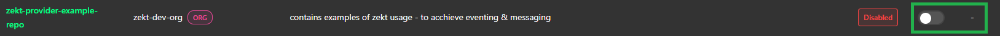

## - Zekt Repos (Provider)

The management console (UI) - is having persona based navigation items. Top one, being the "Provider" item. As soon as you click on it, you will be taken to the "Zekt Repos" tab (for the provider persona). In this view - you will be able to enable / disable repositories for which you are in control of. The enablement is about instrumenting the repositories with the required Zekt Orchestration App (approving it) and placing the required Zekt webhook in the target repository. Likewise, you can disable a Zekt repository from this UI - when the repository is no longer needed.

### - Enable Zekt repository (first time enablement scenario)

This section shows the basic steps (and verification steps) to perform as a customer, when enabling a zekt provider repository. Follow sequence below:

1. Select the repository, which you want to enable for Zekt services from the list of a available repositories. Toggle the switch button in the "Actions" column. Please note that repositories that are not enabled are having the status badge of "Disabled" prior to becoming "Enabled" once you are done with activating the repository. See supportive picture below:

