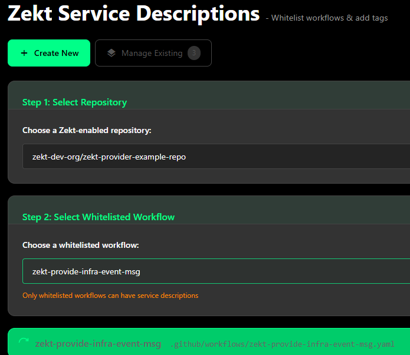
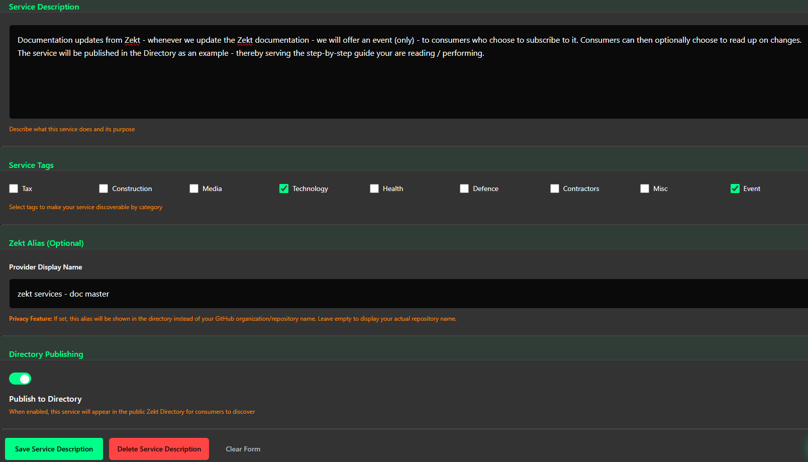

## - Zekt Provider Services

"Service Descriptions" or services in Zekt - refers to the abstraction - where a provider can whitelist a workflow - that provides the eventing and messaging capabilities that can be packaged into a "service" and published to the directory so that consumers can discover it and consume its services. The main intention of "service descriptions" - is to be able to "abstract away" github details - perhaps your github owning entity is named something really "none market friendly" or does not reassamble the "company name" under which you would want to publish your services under.

NOTE: Always stay vigilant against WHO you are consming services from or to whom you are providing services to! Zekt does not provide accountability for services offered from various providers - rather, we provide the consumers to provide testimonials and report abuse to provide a sense of "quality" and "bad behaviour" control to zekt. Zekt has basic "trust badges" to compliment abuse reporting and testimonials but all together - it is your responssibility to decide - who's services your consume, which information you send as messages - to whom! As such - we recommend that you know your providers / consumers - and zekt just acts as the broker of the services you provide.

In this section - we will outline - how to create a "service description" & finally publish it in the zekt directory as a step-by-step. We will build further on the whitelisted workflow we used to examplify the whitelisting capability with. See below guide on creating a service:

Go to the zekt management console. Choose navigation item Provider, the tab "Zekt Service Descriptions". Once in here, you can either select an existing service and modify it or create a new one. In this case - we are going to create a new service. Select the button "Create New". See below (in our case):

1. Select the provider repository, in which the whitelisted workflow reside - that you want to base the service on.
2. Select the whitelisted workflow, on which you want the service to depend upon.

3. Provide a service description that would make sense to intended customers / consumers of yours. A good service description should include things such as:
What service it provides, what type of information (event or event and messaging), contact information (optional) and so forth. This will ease your own service supportability - that intended consumers can sort out your service and know how to contact you if so desired.

4. Add service tags (can be added if additional are needed) - which eases to filter out and find your service from the directory. Add as many / few tags as your want. zekt can expand the amount of tags if needed and requested.

5. Provide a service provider alias. See this as a "publishing name" - basically, your github account / organization might be named: someStrangeGithubName - but you wish to publish your service under the "alias" - awesome-shoe-provider-events. That way - consumers will be easier find you, dont have to worry about the gory details and you dont have to expose details to third party consumers.

Be aware - this also leads to a "trust issue" - where github account / organization - evilWrongDoer - can masequrade themselves as Google Inc. to a broader set of consumers - hence "report abuse" / "testimonals" / "trust badges" + personal responsability and accountability.

6. Choose to publish your service to Zekt directory. Zekt strongly recommends that you should "publish your service" as it by far the most tested, battle proven technique and ways of collaborating that Zekt offers. For now - the only other way of getting collaboration in place is by contacting Zekt and having it manually setup. By publishing your service - its not automatically consumeable by third parties from the directory. The provider still needs to approve "who gets access to what" from within zekt - and can at any time revoke consumer(s) access to a certain service.

7. Once you are satisfied with the options provided - press the "Save Service Description" and short toast will appear indicating that the service is published and stored for further usage.

## - Zekt Services - Publishing to Zekt Directory

The [Zekt directory](/zekt-docs/overview/zekt-directory/) serves as the "marketplace" - where providers can easily publish their services to Zekt - so that events and messages become brokered - but also makes them discoverable easily, either using tags / names or a combination of both to consumers trying to find their provider service. As outline in step #6 - you can publish your service to the directory. The in-depth step-by-step guide on the Zekt Directory - can be found [here](/zekt-docs/guides/handle-zekt-directory/), and shows you how you can verify that the newly created service is now globally available in the directory.