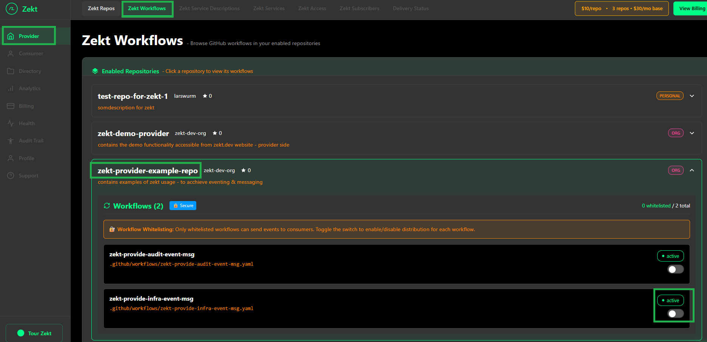
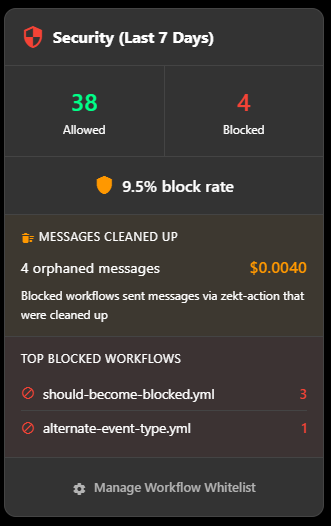

## - Zekt Provider Workflows

A single Github repository can contains no, a single or multiple workflow files (.yaml or .yml files) located in the repository ./github/workflows path.
Within Zekt - we will need to associated a desired workflow with a "service description" which eventually will be used to form a service - which consumers can subscribe events from.

As such - we need to associate a "service" with each individual workflow file - and we need to handle which workflows that should be "allowed" to route events & messages using Zekt and which workflow files will be "ignored / blocked" from routing events to consumers! First step - is to select - which workflows that are allowed to use Zekt (whitelisted) and which ones that should be ignored (none whitelisted). Below follows a step-by-step guide - for allowing a workflow to become whitelisted - thereby Zekt will accept events & messages (from zekt-action) to be routed to its consumers.

1. Go to the Zekt management console. Click on Providers, choose the tab "Zekt Workflows". It will enumerate any enabled repositories in zekt, and the provide the customer the option to expand the specific repository for which you want to handle workflows in. In our case, we will select the repository named "zekt-provider-example-repo". Expanding it - shows that we have two (2) workflows in the repository. As you can see from the below picture - all workflows are considered "Active" as they are within Github - and Zekt never "removes or alters" the workflow itself. Below the "Active" status - there is a toggle bar - which is used to "whitelist" the workflow within Zekt.

In this case - we want to enable the workflow (whitelist) that is named: zekt-provide-infra-event-msg. Toggle the switch next to it - to "whitelist the workflow".

2. Once you have switched (enabled / whitelisted) the workflow on - you will see a toast displayed, saying workflow is not whitelisted! A "whitelisted" badge will appear next to the name of the workflow (indicating it is ready to be used within Zekt). Finally - you can from this UI already proceed to associating the newly whitelisted workflow with a "service" that can be published later. See below:

3. Optionally - create the service from this UI - or have it done in the "Zekt Service Descriptions" tab. For greater details on how to create a service description - [click here]()!

## - None whitelisted workflows - How to track & handle them

As mentioned earlier - zekt only allows "whitelisted workflows" to emit events and messages to become routeable to designated zekt consumers. Workflows that are within a zekt enabled provider repository but is NOT whitelisted - will still emitt events (potentially messages if it calls the zekt-action as well) - which are absorbed by Zekt backend API's. 

Once Zekt captures and persist the message / event - it will be blocked - since it does not match "whitelisted workflows" - however - this generates compute / persistency and transfer cost which are attributed to the "provider" account generating them. As such - we highly recommend - that provider customers - do not have none whitelisted workflows in enabled provider repositories - as we will charge you on the cost for blocking and determining if they are to be routed or not. While it is not expenssive per message / event - it is still a cost - which provider personas should be aware of. At scale - this can become expenssive and is a consideration that should be taken into account by the team - when designing their solution using zekt.

### - Where do I as a provider see blocked events?

To help and to assist customers - to track how many events & messages that have been blocked - and from which workflow they are originating from - there is a special UI part for tracking these things as a provider persona. Go to the Zekt management console, choose the tab named "Delivery Status" as shown below:

In this UI - you can see the number of blocked events and the percentage of blockage (from total amount of events emitted). It provides you with an estimated cost of blocking each message (approx 0.0010 USD / event) and which workflows that are causing and inflicting this additional cost - enabling you to make an active decision of either accepting the additional cost or removing / migrating the workflow that is causing the behaviour.

