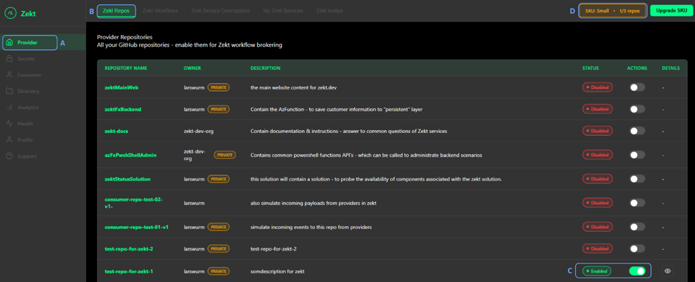

This guide will showcase the "provider repos" part of the Zekt management console UI as seen below. 

In order to be able to choose the "Provider" item on the left hand side of the management console (A) - you need to either be a "Provider" or "Both" (meaning Provider & Consumer) - which is an aossicated property of your profile. This property steers access to the navigation tab, as it only contain functionality relevant if you are a "provider" or "provider and consumer". [Please re-visist Zekt documentation, read Zekt personas in order to make an informed decisions if there are concerns](../overview/zekt-personas).

The first option (functionality) shown, is the "Zekt Repos" tab. This tab (B) - is where you onboard an existing Github repository that you have access to, into the Zekt. Columns Status & Actions - show you clearly if a repository is Enabled or Disabled - from a Zekt perspective (we will never alter Github repository status from Zekt) - in the picture defined as (C).

As soon as you have perform a repository onboarding - the SKU counter will updated (D) - to show you how many repoistories can be onboarded prior to either "de-zektify" an existing repository, or to aquire a higher SKU, enabling you to enable Zekt for additional repoistories.