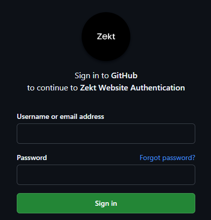

# 🧭 Why do I need Zekt?

## The problem Zekt solves

Modern software teams increasingly operate **across organizational boundaries**:

- SaaS platforms interact with customer repositories  
- Platform teams support multiple business units  
- Partners and integrations rely on external pipelines  

However, **GitHub Actions do not natively support secure workflow execution across organizations**.

This creates a fundamental limitation:

### ❌ You cannot safely trigger workflows across organizations

To work around this, teams typically:

- Share **long-lived tokens or credentials**
- Mirror repositories or duplicate pipelines
- Build custom webhook infrastructure
- Rely on manual coordination or support processes

---

## ⚠️ The cost of current approaches

These workarounds introduce significant business and technical challenges:

### 🔐 Security risks
- Credentials must be shared and stored across boundaries  
- Access is often broader than necessary  
- Difficult to enforce **zero-trust principles**

### 🧱 Operational complexity
- Custom integrations and glue code  
- Fragile webhook implementations  
- Increased maintenance across teams and systems  

### 🐢 Slower delivery
- Manual coordination between organizations  
- Delayed onboarding of customers or partners  
- Limited ability to automate end-to-end workflows  

### 🔍 Lack of observability
- No unified view of cross-organization workflow execution  
- Difficult to debug failures  
- No reliable mechanism for replaying events  

---

## 💡 What Zekt enables

Zekt introduces a new model for cross-organization automation:

> **Trigger workflows across organizations — without sharing access, credentials, or infrastructure**

Instead of relying on:
- direct repository access  
- shared secrets  
- or custom webhook endpoints  

Zekt uses an **event-driven provider/consumer model**.

---

## ⚙️ How it works (simplified)

```text
1. A provider workflow emits an event
2. Zekt securely routes the event (optionally a arbitrary JSON message payload)
3. A consumer workflow executes in another organization


<!--  -->
