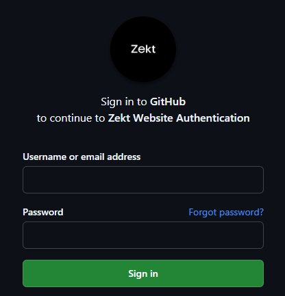

For Zekt - to be able to handle and perform the automation & orchestration capabilities on top of your Github, we need the functionality of our own custom Zekt Github Apps.
The Github Apps - allow integration services, such as Zekt - to provide additional capabilities & functionality on-top of the natively provided services of Github. As a customer of (both) Github & Zekt - you are in charge! 

You must consent to the usage of our custom Zekt apps. They provide the necessary permissions for us, to enable the Zekt services. The customer, can at any given time - go into their repositories that they are in charge of, and remove the access of the Zekt apps. This would effectively remove the capability of Zekt to interact with you repository (or repositories).

There are 2 Zekt custom Github Apps - that will elaborated upon below! These are:

- Zekt OAuth app (Zekt Website Authentication)
- Zekt Orchestration app (zekt-orchestrator-app)

## Zekt OAuth app

The Zekt OAuth app, allows Zekt - to obtain the "access_token" of the user who is logging in to Zekt. Zekt need the personal access_token in order to impersonate the user and validate which repositories the user has access to. As such - the user needs to login using our custom OAuth app, in order to proceed! The zekt authentication UI looks as follows:

The OAuth app / Zekt supports MFA handling, redirects and callbacks! Zekt strongly recommends its members to activate MFA options inside of Github on their personal profile to protect access to repositories and code - thereby improving security posture dramatically!

## Zekt Orchestration app

The Zekt orchestration app - is what allows Zekt to perform its duties! The app (which is needed to be consented to by the customer) - allows for:

- Allows for collecting & distributing webhook meta-data of workflow_run / workflow_job events internal to Github, and send them over to the Zekt backend. The webhook deposits the meta-data gathered by Github, each time a workflow (provide service) has finalized (successfully or failed). The webhook meta-data - is what can be logically considered the "event" that is shared with consumers.

- Allows for distributing events to consumers. The app, provides the necessary permissions to create zekt events, which can be triggered on by consumers. Zekt events - provided to customers, is an aggregation of webhook meta-data (mandatory) and optionally provided message payloads (optional) generated by the provider from within their workflow, by using a custom Zekt Github Action (elaborated upon further on in this documentation - with examples).