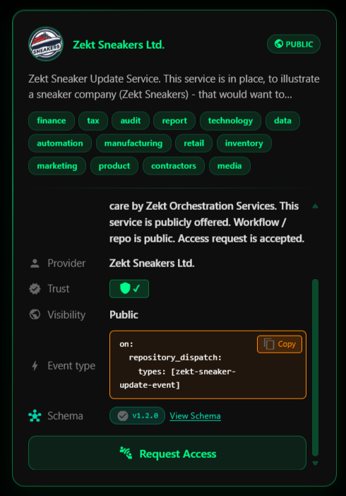

Zekt Directory - is the marketplace, where a zekt-provider (of workflows) can "publish" their services simply by listing it in the directory. Once listed - zekt-consumers, can search and request access to the service and consume the events generated by the providers workflow.

## Zekt Directory - conceptual

As we have learnt, Zekt providers (omit events + optional message payloads) & Zekt consumers (digest events and the corresponding messages). Well - the Zekt directory acts as the marketplace, where a provider can choose to (active decision / not enabled by default / zekt member decides / no extra cost) publish their workflow (the service) to a global audience of potential Zekt consumers!

Once a customer - finds a service, to which they want to subscribe - they can request access to the service (e.g provider workflow) from the zekt management tool. Within the same tool, the zekt provider owning the service - will get alerted, that a request has been sent to them where they can then either approve - or deny the request. As soon, as the consumers request has been approved by the provider - zekt will start brokering the events coming from the provider to the approved consumer(s). Each service published in the Zekt Directory (decision for the customer) is shown as service badge - which can be expanded for more details, as shown below:



From this picture we can see:

- service description - explain the purpose of the service
- service tags - make them easier to find through tagging the service
- service provider - the name of your company / brand
- service trust level - based on Github scoring
- service visibility / exposure - public or organizational
- service event_type - the event_type the service is emitting
- service schema - the optional Zekt Registry Schema - which defines the JSON schema the service is emitting / acting on

###### NOTE: A Zekt service (Provider or Consumer service) can be either exposed & scoped to: 

- 'organization' - meaning the same Github organization that the service is residing within - repository wise. It is common, that Zekt customer only want their service to be visible to customers within their own Github organization!
- 'public' - meaning the Zekt Service will become visible & disoverable to any Zekt customer, through the Zekt Directory! This is common for service providers that are residing across different organizational tenants.

### Service description(s)

When a provider wants to offer a workflow within a repository - for which they are in control of - to a broader audience, they will list the service in the Zekt directory. In order to do so, they will need to package/present the service by creating a "service description". The provider will "package" the workflow - behind a "service description", making it easy to "understand to the consumers", as-in:

```
Service description:                            Owner:
----------------------------------------------------------------
"New cool sneakers have arrived in the store"   "the sneaker dude"
```

If you as a consumer, is super into new sneakers, this service offering might be something for you to request access to. Anyway - this address two concerns. Many times, the github username, is some strange user-name, and does not represent the company or organization, that wishes to offer the service to the public. As such, abstracting away the "github username" to the consumers is important (as much as possible - sometimes not possible). Likewise, just as important it would to be able to "present yourself in a correct manor" using your corporate name or similar. Below are a couple of more realistic scenarios:

- Example  #1: Use the directory
- Requirement: Both teams, are acting as zekt-providers & zekt-consumers
- Scenario description: 

A financial services team - has a process defined which requires - that each time a certain workflow fail - they need an external auditing team to investigate conditions. If no raise conditions were found by the auditing team - they need to send "proceed" to the financial team, so that they can process the next transaction.

The finance team would create a "service description" as:
```
Service description:                          Owner:
----------------------------------------------------------------
"Financial transaction verification failed"   "the finance team"
```
The auditing team would create a "service offering" as:
```
Service description:                          Owner:
----------------------------------------------------------------
"No raise condition found. Proceed."          "the audit team"
```

- Example  #1: Use the directory
- Requirement: One team is acting as consumers, the other team providers
- Scenario description: 

When the sales team has finished their aggregation of forecast figures, have the internal finance team review the figures!

Sales team would create a "service description" as:
```
Service description:                            Owner:
----------------------------------------------------------------
"Forecast figures - analyze stock indications"  "the sales team"
```

### Service event_type:

The property event_type is important to highlight! This is the specific event "name" that is sent to subscribers / recievers - and what they are re-acting to on their end! Again - you cannot have separate workflows, both re-acting to the same event_type within the same repository in Github - as the underlying mechanism for dispatching, is the native Github 'repository_dispatching" mechanism.

### Service slug:

The property service_slug is important to highlight! This is non-changeable service definition string. As Zekt tries to protect its customers from becoming overexposed through Zekt to their subscribers - Zekt needs a way, of uniqely identifying a single Zekt Service, to the servicing Github organization / repository - without exposing that to the requestors! As such - the service_slug property, is the unique identifier - which Zekt uses to route between service providers and subscribers!

### Service contracts:

A Zekt service (provider or consumer services) will have an associated service contract - which maps the underlying service, to its subscribers! The contract definition, supports 1-to-1 mapping but also 1-to-many mappings! Meaning a single service can be exposed once, subscribed to by many - cross repository & organization. Access handling to the service is handled by the involved parties through the Zekt web management console. A subscriber will find the service through the Directory. The request access to it - which pops up as an alert on the service owner side! The owner then approved or denies the request! Auto-apply rules are available if so desired. All access requests / approvals / denials - including auto-approve rules are tracked and audited - visible in the navigation item 'Audit Trail'.