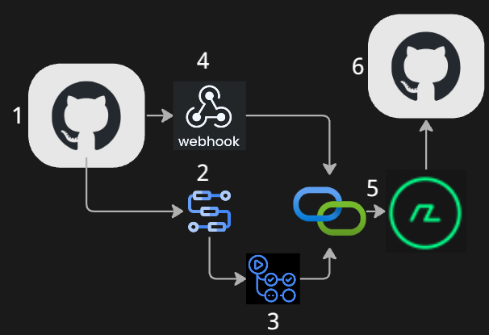
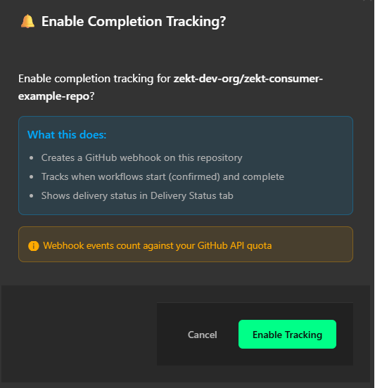
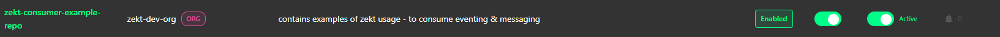
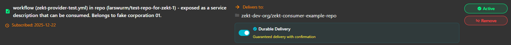
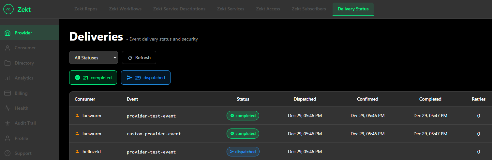

Zekt is at its core an event & messaging services - acting as router for "providers & consumers" who wish to piggy back of their services - by enabling to trigger on a certain "event" and then being able to get "rich meta-data" (a.k.a messages) provided to them from different entities. As such - events is a core functionality to understand. Please note - that zekt does not "introduce" any events on its own, it just uses the event capabilities already built into github and make use this functionality in creative ways.

The capability of "sending events" from a github account to zekt - is by the use of webhooks! The [Zekt Orchestration App](/zekt-docs/overview/zekt-apps/) - which the zekt customer must install in order to instrument zekt to perform its intended duties, allows zekt to both gather workflow meta-data (workflow_run). Further - upon enabling a provider repository in zekt - we place our "zekt webhook" in the providers repository. This way - when a workflow is finished (successfully/unsuccesfully) - it will trigger the webhook - which will POST the meta-data about the workflow (not the workflow content) to the zekt backend services. A key part of this meta-data, is the unique github workflow run_id - which is used as the correlation id of the workflow run instance. The workflow run_id is also used by the [zekt-action](/zekt-docs/overview/zekt-actions/) when POST optional messages to the zekt backend API's. Logically - one can describe this as shown in the picture below:



1. Providers repository. The provider has enabled on of their repos for zekt services. This requires the provider to install and associate the repository with the Zekt Orchestration App - which in turn, provides zekt with the permissions needed. It also places a zekt webhook within the enabled repository.
2. Providers whitelisted workflow. For more details on "whitelisting" workflows in Zekt - please click [here](/zekt-docs/guides/handle-zekt-provider-workflows/). Provider has one (or several workflows) workflow in their enabled repository. When the workflow is invoked (running) it is automatically provided a unique run_id by github underlying services. This unique ID - is serving as the correlation id - used by zekt services - to correlate "events" and "messages" (by aggregating them) sent by provider to zekt services. 
3. zekt-action (message) is optional. zekt-action is implemented as an optional (github action) component - that can be placed in a separate step (within a job) of the workflow (#2 in this step-by-step description). zekt-action requires basically 3 things:

- event type (arbitrary name)
- payload (message - max 512 KB)

an example of a zekt-action invoccation (from a workflow) is found below

```yaml
      - name: Send Event to Zekt
        id: zekt
        uses: zekt-dev-org/zekt-action@vX.Y.Z                  #<-- check zekt-action repo for latest version
        with:
          event-type: 'custom-provider-event'                  #<-- arbitrary event-type, flexible  
          payload: ${{ steps.build-payload.outputs.payload }}  #<-- arbitrary payload, flexible
```
As the run_id of the workflow, is available from within the workflow when it is being executed - the "message" that is generated when calling the zekt-action - will with a high probability be "arriving before" the event is arriving at the zekt backend. To be able to stitch together the right message payload, with the correct event - we use the unique run_id as the correlation property. For now - assume the message (delivered through zekt-action) is posted to the zekt backend API's and persisted.
4. Once the provider workflow has been executed - it might that finished as intended (successfully) or it failed - independently - the zekt webhook is triggered and sends meta-data about the workflow that was executed to the zekt backend API's. Again - the default github meta-data about a workflow instance execution - contains the unique run_id which is part of the payloaded that is deposited to zekt API's. 
5. As zekt backend services - at this time - have an event (with unique run_id) that has arrived - it will look in the persisted layer - to check if there is a corresponding message (from zekt-action) that is to be aggregated with the event using the run_id as the correlation. If it finds a message (as it does in this example) - it will aggregate the message and the event into one payload - check the zekt policy engine (logic) - to determine if the workflow is whitelisted (if not it will be blocked and charged anyway), which consumers to distribute the payload to and on.
6. In this example - the consumer is now getting the "event & message" in one payload (JSON) - send as a repository dispatch event to their repository. From this point on - it is the consumers responsbility to make sure they are having a workflow, that triggers on the 'custom-provider-event' type in this example.

## - Durable Delivery - optional functionality

By default - zekt approach to delivering events (messages) is fire-and-forget. Meaning - as soon as an event and message is distributed to the designated consumer, it is a one-time effort & attempt of delivering that event. If the event is deposited to the github API's successfully - zekt will not attempt or be able to re-send that "payload" once it has been flushed out of the persistency layer. While this works in most cases for most consumer workloads - sometimes, consumers dont want to "miss a single event" that is ingressing to them (as it is business critical information) - and is desiring to have a more resilient and durable capability - where several attempts are done to deliver the event payload & get confirmation on delivery (track). This is where zekt's "durable delivery" comes into play described below:

- Purpose: Guarantees event delivery to consumer webhooks with automatic retries and state tracking
- Persisted: Uses event-deliveries persitency layer (correlates using correlationId property)
- Persisting States: Dispatched → Confirmed → Completed (or Failed)

1. Initial Dispatch (Provider Workflow Completes)

Trigger: Provider workflow completes and calls Zekt webhook

- Function: ProcessWorkflowWebhookFunction
- Process: Receives GitHub webhook (workflow_run completed event)
    - Validates signature and payload
    - Queries provider-consumer-mappings to find subscribed consumers
    - For each consumer workflow:
        - Creates event-delivery record with status Dispatched
        - Stores correlation ID, provider/consumer metadata
        - Archives payload to archived-payloads container (Time Travel feature)
        - Dispatches repository_dispatch event to consumer via GitHub API
        - Saves delivery record with GitHub response
    - Updates usage metrics (API calls, webhook deliveries)

Key Fields:

```
DeliveryStatus = DeliveryStatus.Dispatched
DispatchedAt = DateTime.UtcNow
CorrelationId = "correlation-id-from-provider"
DeliveryId = "delivery-{guid}"
```

2. Confirmation (Consumer Workflow Starts)

Trigger: Consumer workflow starts and calls confirmation endpoint

- Function: ConfirmEventDeliveryFunction
- Endpoint: POST /api/event-delivery/confirm
- Consumer Workflow Action: Calls this endpoint in first step
- Process:
    - Receives correlationId from consumer workflow
    - Queries event-deliveries by correlation ID
    - Updates delivery record:
        - Status: Dispatched → Confirmed
        - Sets confirmedAt timestamp
        - Increments confirmation attempt counter
    - Returns confirmation details to consumer

Key Fields:

```
DeliveryStatus = DeliveryStatus.Confirmed
ConfirmedAt = DateTime.UtcNow
```

3. Completion (Consumer Workflow Finishes)

Trigger: Consumer workflow completes successfully or fails

- Function: CompleteEventDeliveryFunction
- Endpoint: POST /api/event-delivery/complete
- Consumer Workflow Action: Calls this endpoint in final step
- Process:
    - Receives correlationId + success flag from consumer
    - Queries event-deliveries by correlation ID
    - Updates delivery record:
        - Status: Confirmed → Completed (if success) or Failed
        - Sets completedAt timestamp
        - Stores consumer workflow conclusion
        - Marks as finalized
    - Updates usage metrics

Key Fields:

```
DeliveryStatus = DeliveryStatus.Completed // or Failed
CompletedAt = DateTime.UtcNow
ConsumerWorkflowConclusion = "success" // or "failure"
IsFinalized = true
```

4. Health & Statistics Calculation

Function: ConnectionsService - LoadQuickStatsAsync()

- Process:
    - Queries event-deliveries for last 24 hours
    - Counts total events per connection
    - Calculates success rate (Completed + Confirmed) / Total
    - Checks for recent activity (events within last 7 days)
    - Determines health status:
        - Healthy: ≥98% success + recent activity (or no events yet)
        - Warning: 90-98% success OR no recent activity
        - Critical: <90% success

Used By: "My Connections" UI, webhook health checks, diagnostics

5. Replay/Time Travel Feature (Add-on feature within Analytics package)

Function: ReplayArchivedEventFunction

- Endpoint: POST /api/replay/{deliveryId}
- Process:
    - Retrieves original delivery record by ID
    - Fetches archived payload from archived-payloads
    - Creates new delivery record (new delivery ID)
    - Re-dispatches to consumer via GitHub API
    - Marks original as replayed, stores new delivery ID

Key Feature: Non-destructive replay using archived payloads

6. Diagnostics & Troubleshooting

Function: ConnectionsService - GetConnectionDiagnosticsAsync()

- Endpoint: GET /api/connections/{id}/diagnostics
- Process:
    - Queries recent failed deliveries (last 30 days)
    - Groups errors by category:
        - Service Unavailable (503)
        - Timeouts
        - Auth failures (401/403)
        - Rate limiting (429)
        - DNS/Network errors
    - Fetches last 10 failures with full error messages
    - Generates actionable recommendations based on error patterns
    - Calculates webhook health (success rate for specific connection)

Used By: Diagnostics modal in "My Connections" UI

7. Data Retention

event-deliveries: 396 days (13 months) TTL - auto-cleanup
archived-payloads: 90 days TTL - for Time Travel replay
Finalized deliveries: Marked with isFinalized = true flag

Key Benefits
------------

✅ Guaranteed Delivery Tracking: Know exactly if events reached consumers
✅ Three-Phase Lifecycle: Dispatch → Confirm → Complete with timestamps
✅ Health Monitoring: Automatic calculation of success rates and trends
✅ Failure Diagnostics: Detailed error categorization and recommendations
✅ Time Travel/Replay: Re-send historical events from archived payloads
✅ Non-Blocking: Consumer workflows control confirmation/completion timing
✅ Audit Trail: Full lifecycle history with correlation IDs

Key drawbacks
-------------
Durable delivery ensures that you can have several retries to of a single event and persist it beyond one-time delivery. However - this requires additional compute / storage & transfer efforts and as such is more costly compared to one-time delivery. In general, Zekt recommends customers to use non-durable delivery (default) event delivery unless the workload matches one of the following criterias:

- Cost "of loosing an event" is greater then processing cost required of enabling durable delivery per event (business critical content in event & messages)
- Regulated environments and workloads - there are scenarios where it is regulated that events (+ messages) must be able to retains / retried for a certain time period / amount of retries.

## - Where do I enable "durable delivery" as a consumer?

Durable delivery is a consumer feature - where the consumer decided (opt-in) to enable durable delivery for a certain workload on their end. By enabling durable delivery - the customer accepts that additional cost that the functionality will introduce towards their montly billing (which is trackable as function runtime) account. Enabling "durable delivery" in zekt - is a two-step action outlined below:

1. Open the zekt management console interface. Click on the navigation item "Consumer". Choose the tab "Zekt Repos". Select the enabled "zekt consumer repo" that you wish to enable for "durable delivery". Toggle the switch in the "COMPLETION" column to on. In the below screenshot, it has not been activated yet.


2. A pop-up modal will appear, informing you that zekt will place a webhook in the consumer repository (you selected) and that actions it perform will be tracked towards your Github API quota. Accept if you want to proceed, by selecting the "Enable Tracking" button.



3. The modal will redirect you to the "Zekt Repos" view when the webhook has been added to your repository (that you selected). The UI is now indicating that the repository is enabled for "event completition tracking" as in below picture:



4. Second logical step - in order to enable durable delivery - is to navigate to the tab named "Zekt Subscriptions" (in the Consumers navigation item view). This view lists the providers "service description" that you are subscribing events (and messages) from. Select the "service" that is matching the consumer repository that you enabled in step #1 for completition (easiest by checking the UI property: --> Delivers to: property in orange). Below it there is a "Durable Delivery" toggle bar that needs to be enabled as in below picture:



## - How do I track the status of an event sent - as a provider?

As a provider - you would like to know - if a consumer (of your published service) is using durable delivery - and would want to track event deliveries to them! You can do so by opening the Zekt management console, navigation item "Provider" and then looking in the tab: "Delivery Status"



From this screenshoot we can see that one consumer has "completition tracking" enabled - by the "Status" column badge (Completed) - and the meta-data on the columns: "Confirmed" and "Completed". It also shows a column, at what retry it became successfully completed - first try (0 retries) in this case.


